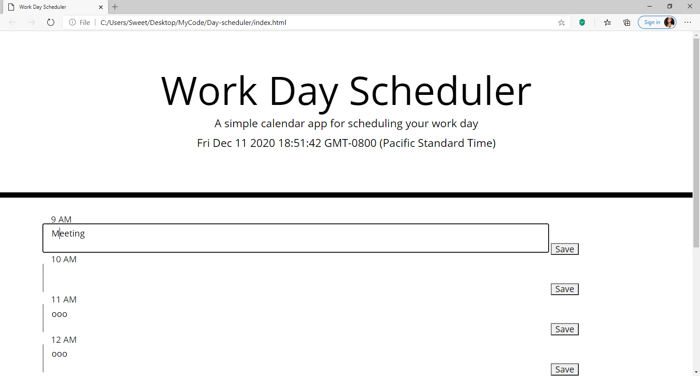

# Day-scheduler

https://jzsweet.github.io/Day-scheduler/
a simple calendar application that allows a user to save events for each hour of the day.

* the current day is displayed at the top of the calendar when scroll down.
* click into a time block then user can enter an event.
* block is color-coded to indicate whether the event is in the past, present, or future.
* click the save button for that time block then that event is saved in local storage.
* refresh the page then the saved events persist.
